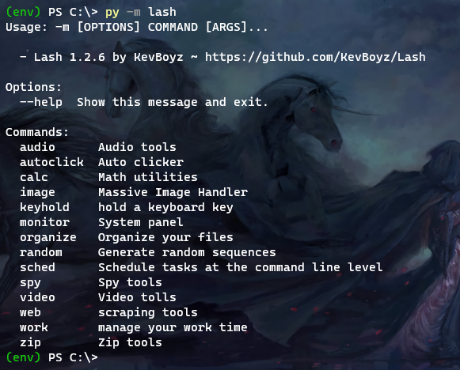

# Lash,  the py-package 

This package provides a set of desktop tools that simplify and automate multiple   
processes. Lash also has utility functions that cover some needs of desktop users.  

Thinking about being simple and effective, Lash was developed with a command     
line interface, having syntax similar to cli's linux, with options args and help sections.  

~ **Installing:** `pip install lash` ~ **Executing:** `python -m lash` ~ **help-sec**: `--help`

  
**Access [KevBoyz-Docs/lash](https://kevboyz.github.io/KevBoyz-Docs/sub-pages/documentations/lash/index.html) for documentation.
[Pypi/lash](https://pypi.org/project/lash/1.2.1/) for Pypi page.**  
**Updated version (pt-br): [7562Hall/lash](https://kevboyz.github.io/7562Hall/sub-pages/lash/index.html)**

## Some examples

### Compress file in zip archive

    $ py -m lash zip compress C:\Users\User\Documents
    Compacting archives, please wait...

    - - Process list - -
    Compacting: .gitattributes
    Compacting: .gitignore
    Compacting: setup.cfg
    Compacting: setup.py
    [...]
    process completed, 206 files compacted

### Scheduling commands execution

    $ py -m lash sched run --help
    Usage: -m sched run [OPTIONS] command <hours> <minutes> <seconds>

    Run commands repetitively at a given interval starting from
    current moment.

    $ py -m lash sched run "py -m lash random" 0 0 2
    78311
    13918
    64280
    [...]

    Aborted!

# Release notes

## v1.2.6 - General upgrades

* New command: `work` for time manage
* New command `cartesian` for _math group_
* Better clock display for _sched group_
* Bugfix in `monitor` command
* _Code review_ (All files)
* Some commands and functions have been _documented_
* Some commands have been moved to other groups

## v1.2.5 - Web scraping

* Read Wikipedia articles/summaries with `wiki`
* Read top news using `news` (Google News)
* Yt moved to _web group_, new feature: **-list**
* Command _new_ removed
* Command _taskkiler_ removed
* Command _getconfig_ removed

## v1.2.4 - Media support

* Download musics/videos with `yt` command
* Edit audio files with `audio` functions; cut, get
* Edit/make video files with `video` functions; rec, make, resume, intro, end, cut
* Monitore your system with `monitor` command (TUI dashboard)
* New command to image: `make_video`
* New command to web: `mail`
* Commands stylezed with Rich lib
* Web `ghscrape` bug fix

## v1.2.3 - Bug fix and math

* Handling errors in `spy injection`
* New command for calc: `binomial`
* New command for calc `trinomial`
* Plot graph implemented for math functions

## v1.2.2 - Spy upgrades

* New command: `spy injection`remote commands injection host/client
* Confidentially error fixed on `spy crypt`

## v1.2.1 - Image upgrades

* New command for image: `adjust`
* New options for image: -all, -c
* Load bar implemented on image commands

## v1.2.0 - General upgrades

* Image handling implemented: Flip\Resize
* *Sched* group upgraded: better syntax and display
* *Zip* group upgraded: better syntax, display, no errors and new options
* `spy crypt` upgraded: better syntax and new options (-cl, -ex)
* `autoclick` upgraded: only single and double click option
* `web new` fixed, generating files correctly now
* `random upgraded`: Generate random sequences with numbers letters and specials
* New command for `web` : `ghscrape` → scrap a GitHub profile
* New command for `zip`: `zipview` → view the files inside a zip archive

## v1.1.3.1 - Readme from Pypi page

* Rst text added to Pipy page

## v1.1.3 - Bug fix

* Auto-help text sections updated
* web new command now create the template files using the code declared as string at config.py
* New command: getconfig See the config file path
* beep.waw and web_pkg.zip removed from package
* Error .zip.zip fixed in zip extract command
* Licence classifier added to setup.py
* Brave.exe removed from config file
* -o Option added to autoclick, do a only single

## v1.1.2 - Bug fix

* Function autoclick fixed

## v1.1.1 - Just a new function

* New feature: Encrypt/Decrypt files with `spy crypt` command.
* Licence error fix.

## v1.1.0 - Bug fix and upgrades

* Bug fix and upgrades in `zip compress/extract` command.
* Bug fix and upgrades in `calc prob` command
* Bug fix and upgrades in `organize` command.
* Bug fixed in `web new` command, generate default new web project.
* Implementing `configs`, additional configurations to package.
* Implementing `task-killer` command, kill chain of tasks to optimization.
* Change licence to **GNU-GPLv3**
* *Log* command renamed to `spy`
* New features for sched command:
* Support for *multi-time* options in `run` command
* * Sub-command: `exec` -> Execute a task from determined moment of day
* * Sub-command: `wait` -> Wait x time, run a task once and exit

  [image]: Images/lash_print.png
