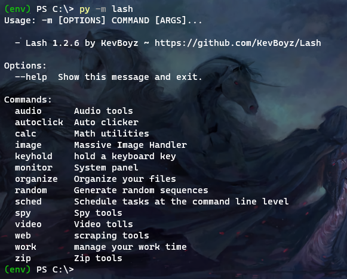

# Lash,  the py-package 

A set of desktop tools that simplify and automate multiple processes — file handling,
image editing, scheduling, web scraping, spy tools, math, and more.

```bash
pip install lash          # core only
pip install lash[all]     # all optional tools
python -m lash --help
```

**[Pypi](https://pypi.org/project/lash) · [Docs](https://kevboyz.github.io/KevBoyz-Docs/sub-pages/documentations/lash/index.html) · [Docs pt-br](https://kevboyz.github.io/7562Hall/sub-pages/lash/index.html)**



---

## Plugin system (v1.3.0)

Lash uses an opt-in plugin architecture. The base install requires only `click` —
commands and their dependencies are installed on demand.

```bash
lash plugins list  # see what's available
lash add spy calc  # install plugins
lash remove calc   # and remove
```
---

**This package has many dependencies. It is highly recommended to use a venv or your preferred environment manager for installation.**

## Docs

| File | Contents |
|---|---|
| [RUNNING.md](RUNNING.md) | Install, run, plugin usage, examples, contributing |
| [RELEASE_NOTES.md](RELEASE_NOTES.md) | Changelogs