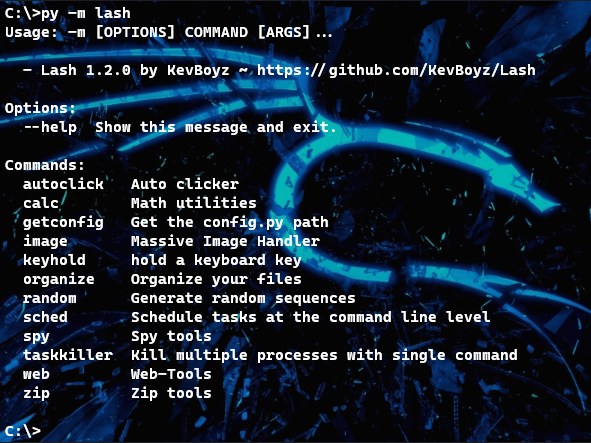

# About Lash
This package provides a set of desktop tools that simplify and  
automate repetitive processes. Lash also has utility functions  
that cover some needs of desktop users. 

Thought to be simple and effective, Lash was developed with a   
command line interface that has self-help and semantic commands.

## Lash overview 
_Installing:_ `pip install lash`  
_Executing_: `python -m lash`  
**Getting help**: `python -m lash --help`  

_Please ignore all `-m` in __Usage__ line_.     
## Usage examples
---
    $ py -m lash zip compress --help
    Usage: -m zip compress [OPTIONS] <path>

    Compress files in zip archive
    Options:
    -fn TEXT  Output file name
    -v        Verbose mode   [default: True]

    $ py -m lash zip compress -fn "Zip" C:\Users\Kevin\Documents
    Compacting archives, please wait...

    - - Process list - -
    Compacting: .gitattributes
    Compacting: .gitignore
    Compacting: setup.cfg
    Compacting: setup.py
    [...]
    process completed, 206 files compacted

---
    $py -m lash sched run --help
    Usage: -m sched run [OPTIONS] command <hours> <minutes> <seconds>

    Run commands repetitively at a given interval starting from
    current moment.

    $ py -m lash sched run "py -m lash random" 0 0 2
    78311
    13918
    64280
    [...]
    
    Aborted!
### Lash Configurations  
From version 1.1.0, **configurations** were implemented in the package,   
which can be edited manually in _/lash/Exportables/config.py_

**Thanks for ReadMe**
